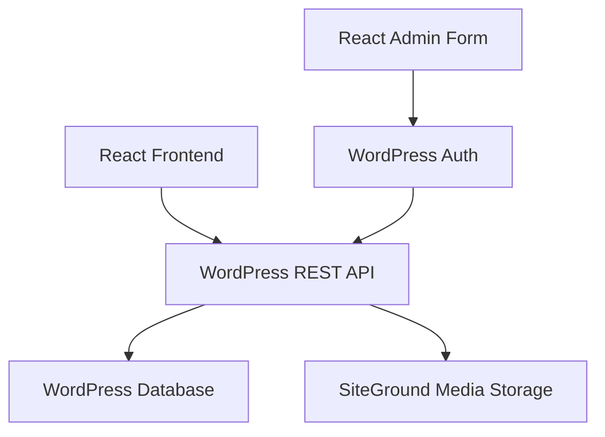

# WordPress Integration for Rocoteca Madrid Blokes

## Overview

This project migrates the Rocoteca Madrid Blokes website from Google Sheets + Google Drive to WordPress + Advanced Custom Fields. The React frontend now fetches data from WordPress REST API and images are stored on SiteGround hosting.

## Architecture



## Prerequisites

### WordPress Setup
1. **Advanced Custom Fields Plugin** - Install and activate
2. **Categories** - Create: PUZLE, TECNICO, ENTRENAMIENTO, COORDINACION
3. **ACF Field Group** - Create with:
   - `bloke_description` (Text Area, 300 chars)
   - `bloke_gallery` (Gallery field, max 3 images)
   - `bloke_category` (Taxonomy field linked to categories)
4. **Application Passwords** - Enable for editor users

### Environment Variables
Update `.env` file:
```env
VITE_WORDPRESS_URL=https://rocomadrid.com
# Optional fallback to Google Sheets
# VITE_GOOGLE_SHEETS_API_KEY=your_key
# VITE_GOOGLE_SHEET_ID=your_id
```

## Installation

### 1. WordPress Configuration

#### Install Advanced Custom Fields
1. Go to WordPress Admin → Plugins → Add New
2. Search "Advanced Custom Fields"
3. Install and activate

#### Create Categories
1. Go to Posts → Categories
2. Create categories with these exact names:
   - PUZLE
   - TECNICO
   - ENTRENAMIENTO
   - COORDINACION
3. Note the category IDs (visible in URL or via REST API)

#### Create ACF Field Group
1. Go to Custom Fields → Add New
2. Field Group Title: "Bloke Details"
3. Add fields:
   - **Description**: Text Area, Field Name `bloke_description`, Character Limit 300
   - **Gallery**: Gallery, Field Name `bloke_gallery`, Minimum 1, Maximum 3
   - **Category**: Taxonomy, Field Name `bloke_category`, Taxonomy: Categories
4. Location Rules: Show if Post Type is equal to Post
5. Publish

#### Enable Application Passwords
1. Go to Users → All Users
2. Edit each editor user
3. Scroll to "Application Passwords"
4. Create new password (e.g., "react-admin")
5. **Save the generated password** (appears only once)

### 2. React Application Updates

#### Update Category IDs
Edit `src/hooks/useWordPressPosts.js` and update `CATEGORY_MAP` with your actual WordPress category IDs:
```javascript
const CATEGORY_MAP = {
  PUZLE: 1,      // Replace with actual ID
  TECNICO: 2,    // Replace with actual ID
  ENTRENAMIENTO: 3, // Replace with actual ID
  COORDINACION: 4,  // Replace with actual ID
}
```

#### Build and Deploy
```bash
npm install
npm run build
```

Upload the `dist/` folder to `rocomadrid.com/blokes/`

### 3. Admin Interface

The admin interface is available at `/admin` (you need to configure routing).

#### Option A: Separate URL
Deploy admin to a different URL (e.g., `rocomadrid.com/blokes-admin/`)

#### Option B: Hash Routing
Update `src/main.jsx` to include routing:
```javascript
// Add React Router
import { BrowserRouter, Routes, Route } from 'react-router-dom';
import App from './App';
import AdminApp from './admin/AdminApp';

ReactDOM.createRoot(document.getElementById('root')).render(
  <BrowserRouter>
    <Routes>
      <Route path="/" element={<App />} />
      <Route path="/admin" element={<AdminApp />} />
    </Routes>
  </BrowserRouter>
);
```

## Testing

### 1. Test WordPress Connection
```bash
node scripts/test-wordpress.js
```

### 2. Test Public Site
1. Visit `rocomadrid.com/blokes`
2. Verify cards load from WordPress
3. Verify images load from SiteGround
4. Test category filtering

### 3. Test Admin Interface
1. Visit `/admin` (or your admin URL)
2. Login with WordPress Application Password
3. Test image upload
4. Test creating a new bloke

## Migration from Google Sheets

### Manual Migration (Recommended)
1. Export Google Sheets data to CSV
2. Manually create posts in WordPress using the admin interface
3. Upload images to WordPress media library

### Automated Migration
Run the migration script (requires Node.js and additional setup):
```bash
cd scripts
npm install node-fetch googleapis dotenv
node migrate.js
```

## Troubleshooting

### Images Not Loading
1. Check WordPress media URLs are accessible
2. Verify ACF gallery field is properly configured
3. Check CORS settings on WordPress

### Authentication Failed
1. Verify Application Password is correct
2. Check user has proper permissions (Author role)
3. Ensure WordPress REST API is accessible

### ACF Fields Not Showing
1. Verify ACF plugin is active
2. Check field group is attached to Posts
3. Test ACF REST API endpoint: `/wp-json/acf/v3/`

## Rollback Plan

If issues arise, revert to Google Sheets:
1. Comment out WordPress URL in `.env`
2. Uncomment Google Sheets variables
3. Revert `App.jsx` to import `useGoogleSheets`
4. Rebuild and redeploy

## Support

For issues or questions, refer to:
1. WordPress REST API documentation
2. Advanced Custom Fields documentation
3. React Router documentation (if implementing routing)

## License

This integration is part of the Rocoteca Madrid Blokes project.